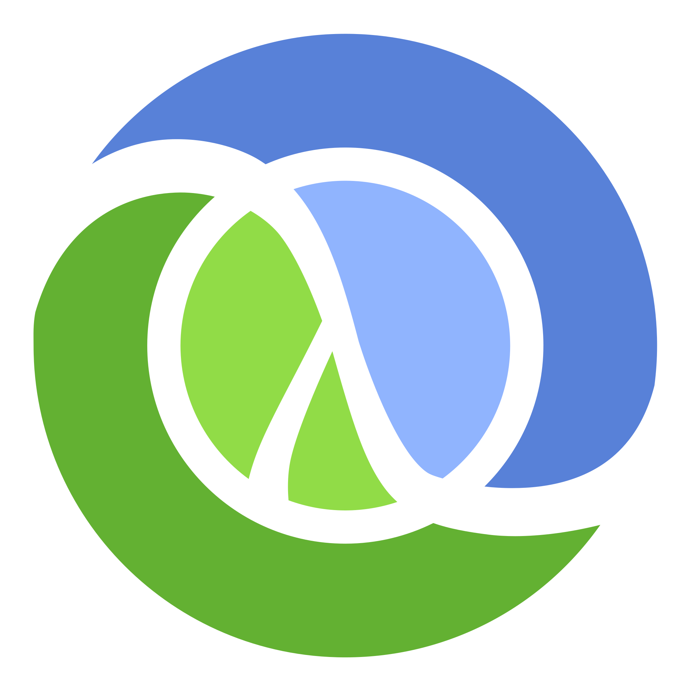

<h1 align="center">Hello there 👋!</h1>

## [💼🗂️ Portfolio Website 📁📊](https://rodrigogarciapadilla.netlify.app/)

> Computer Scientist
> Facultad de Ciencias @ UNAM.  
> CDMX, Mexico.  

Hello there as part of competitive environments as **Scout Organization** 🏕️🚩 and **Sport Disciplines** 🚣‍♀️, that allowed me develope emotional intelligence and social skills involved with people managing and be capable of lead or be leaded. Habits are the most important for me, so strict organization and stressfull deadlines are not a problem due to the confident in planification of responsabilities systems.

At present **Computer Scientist** 🖥️ interested in Data Science and **Web Developing** 🌐 guided to **IoT devices** 🤖.

## Developer stack

  

  ### Multiuse
  
  
  
  
  
  
  
  
  
  
  
  
  

  ### Web

  
  
  
  
  
  
  

  ### Data Science & DBA

  
  
  
  
  
  
  

  ### IoT

  
  
  

  
## Projects

### Web Developement

- [Fake PNG Detector]( https://github.com/Rogarpa/DevTools )

> - Dependency Injection
> - Infinite Scrolling
> - Dynamic Search Suggestions
> - ZIP batch image download
> - REST API
> - Image Selection
> - Middleware CORS and Parsing

- [Salads Menu]( https://github.com/Rogarpa/Portfolio/tree/SaladsWebPage )

      

> - Backend with Spring
> - Front with JSP
> - DB with PostgreSQL
> - Backend Errors Validation
> - Dockerized requirements

### Image Digital Processing

- [Image Filtering Editor]( https://github.com/Rogarpa/Portfolio/tree/DIP )

> - Convolutional
> - Morphological
> - Watermark remover
> - Mosaic recursive
> - Dithering

> 

### Deep Learning

- [Object Detection]( https://github.com/Rogarpa/Portfolio/tree/NeuralNetwork )

> - Convolutional Neural Net Trainning

>   

### Data Science

- [Terrorism Data Minning]( https://github.com/Rogarpa/Portfolio/tree/DataMinning )
> - Data Cleanning
> - Data Preprocessing
> - Data Transformation

> 

### Internet of Things

- [ESP32 Projects]( https://github.com/Rogarpa/Portfolio/tree/IoT )
> - Connection with Google Assistant
> - Connection with Telegram Bot

>    
